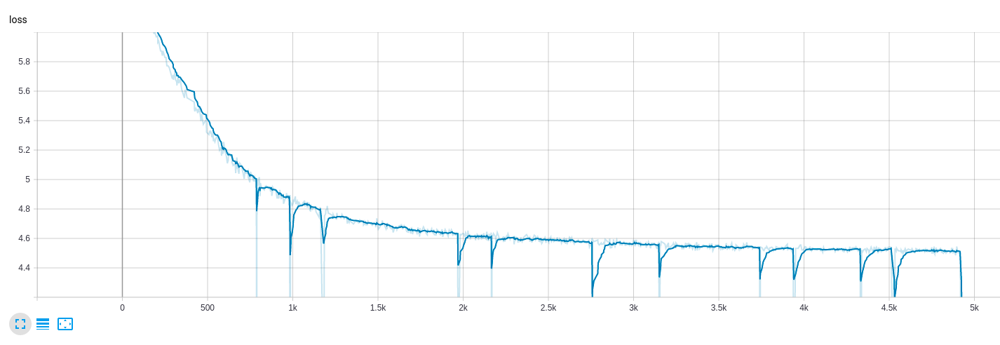

# Task Agnosgtic Unsupervised Pretraining


Crude implementation of simCLR paper. Used the ```LARS``` optimizer over the ```contrastive loss``` function as described in the paper to train a contrastive model. Used this model as encoder and added fully connected layer to create a classifier. 




Below is the observations for the classifer trained using TAUP and supervised learning.
|model|num_samples|accuracy|epochs|
|---|---|---|---|
|Supervised Learning|50000|97.3|   103|
|TAUP+Supervised Finetuning| 5000  | 93.5  | 45  |
|TAUP+Supervised Finetuning   | 10000  | 93.9  | 23  |
|TAUP+Supervised Finetuning   | 10000  | 95.34  | 45  |


### Scripts

- To train the TAUP model with contrastive loss: ```train_taup.py```
- To train the clf over the TAUP model          : ```train_classifier.py```

### To Do: 
- Test the effect of BatchNormalization in the projection head
- Add the knowledge distilation part
- Test it out on a dataset more complicated than CIFAR

Reference: https://arxiv.org/pdf/2006.10029.pdf
